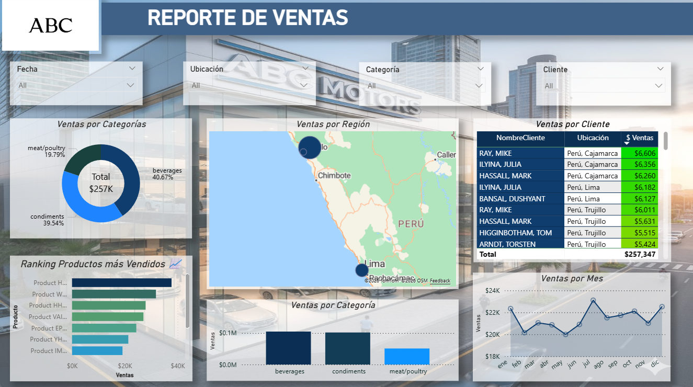
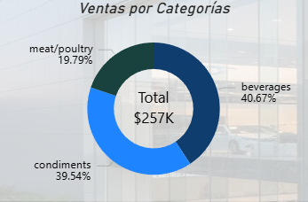
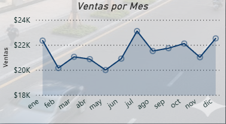
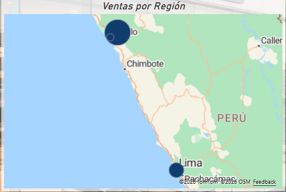

# 📊 Análisis de Desempeño de Ventas y Clientes – Power BI

## 📌 Overview
Este proyecto consiste en el análisis de un conjunto de datos de ventas con el objetivo de transformar información cruda en **insights accionables** que apoyen la toma de decisiones empresariales.  
El análisis se presenta mediante **dashboards interactivos desarrollados en Power BI**, enfocados en ventas, productos, clientes y ubicaciones.

---

## 🎯 Objetivo
Analizar el desempeño de las ventas para:
- Identificar tendencias mensuales
- Detectar productos con mayor volumen de ventas
- Evaluar el comportamiento de los clientes
- Analizar el rendimiento por ubicación geográfica

---

## 🗂️ Dataset
- **Tipo:** Dataset simulado  
- **Fuente:** Archivo Excel  
- **Contenido:**  
  - Clientes  
  - Productos  
  - Categorías  
  - Ubicaciones  
  - Fechas  
  - Ventas  

---

## 🔧 Proceso
- Limpieza y transformación de datos utilizando **Power Query**
- Modelado de datos y creación de relaciones entre tablas
- Creación de **KPIs clave**:
  - Ventas Totales
  - Ventas Mensuales
- Diseño de **dashboards interactivos** con filtros dinámicos por:
  - Fecha
  - Categoría
  - Cliente
  - Ubicación

---

## 📊 Dashboards y Visualizaciones

### 📌 Dashboard General

### 📌 Ventas por Categoría

### 📌 Ranking de Productos

### 📌 Tendencia de Ventas Mensuales

### 📌 Ventas por Cliente y Ubicación

---

## 🔍 Insights Clave
- Un grupo reducido de productos concentra la mayor parte de las ventas totales
- Se identifican variaciones mensuales claras en el comportamiento de ventas
- Determinados clientes y ubicaciones generan un mayor aporte al ingreso total

---

## 💡 Recomendaciones
- Priorizar los productos con mayor rendimiento comercial
- Diseñar estrategias específicas para los meses con menor nivel de ventas
- Enfocar los esfuerzos comerciales en clientes y regiones de alto valor

---

## 🛠️ Herramientas Utilizadas
- Power BI  
- Microsoft Excel  

---

## 👤 Autor
**Luis Huamaní**  
Proyecto desarrollado como parte de mi portafolio de **Analista de Datos Junior**.
